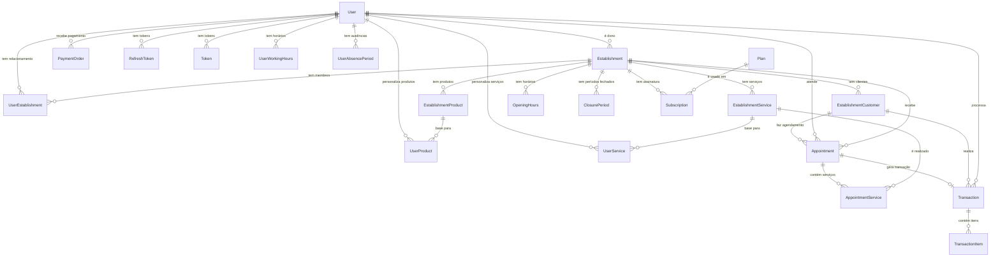
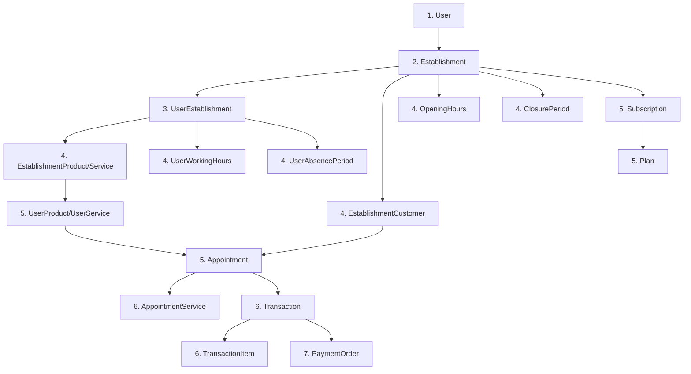

# 📘 Arquitetura e Regras de Negócio - Barber Shop Manager

## 📋 Índice

1. [Visão Geral da Aplicação](#visão-geral-da-aplicação)
2. [Modelo de Dados e Relacionamentos](#modelo-de-dados-e-relacionamentos)
3. [Fluxo de Criação de Registros](#fluxo-de-criação-de-registros)
4. [Regras de Negócio](#regras-de-negócio)
5. [Principais Mudanças da Refatoração](#principais-mudanças-da-refatoração)

---

## 🎯 Visão Geral da Aplicação

### Descrição do Sistema

O **Barber Shop Manager** é um sistema de gerenciamento completo para estabelecimentos de beleza e barbearias. A aplicação oferece uma solução multi-tenant que permite gerenciar múltiplos estabelecimentos, cada um com seus próprios funcionários, clientes, serviços, produtos, agendamentos e transações financeiras.

### Principais Funcionalidades

#### 1. **Gerenciamento de Usuários e Estabelecimentos**
- Sistema unificado de usuários (proprietários e funcionários)
- Criação e gerenciamento de estabelecimentos
- Relacionamento flexível entre usuários e estabelecimentos através de `UserEstablishment`
- Suporte a múltiplos papéis (OWNER, ROOT, RECEPTIONIST, HAIRDRESSER, BARBER)

#### 2. **Gerenciamento de Clientes**
- Cadastro de clientes por estabelecimento
- Histórico de agendamentos e transações por cliente
- Validação de unicidade de email e telefone por estabelecimento

#### 3. **Catálogo de Produtos e Serviços**
- Produtos e serviços cadastrados por estabelecimento
- Personalização de preços, comissões e duração por usuário
- Controle de estoque para produtos

#### 4. **Sistema de Agendamentos**
- Agendamento de serviços com múltiplos serviços por agendamento
- Validação de conflitos de horário
- Cálculo automático de duração e valor total
- Status de agendamento (PENDING, CONFIRMED, COMPLETED, CANCELLED, NO_SHOW)

#### 5. **Gestão Financeira**
- Transações financeiras vinculadas a agendamentos ou independentes
- Suporte a múltiplos métodos de pagamento (CASH, CREDIT_CARD, DEBIT_CARD, PIX, OTHER)
- Sistema de comissões por produto/serviço
- Ordens de pagamento para funcionários
- Cálculo automático de comissões

#### 6. **Configurações de Funcionamento**
- Horários de funcionamento por estabelecimento
- Períodos de fechamento (feriados, férias)
- Horários de trabalho individuais por usuário
- Períodos de ausência dos usuários

#### 7. **Autenticação e Segurança**
- Autenticação JWT com refresh tokens
- Verificação de email obrigatória
- Soft delete em todas as entidades principais
- Rastreamento de quem realizou exclusões

#### 8. **Sistema de Assinaturas**
- Planos de assinatura configuráveis
- Assinaturas por estabelecimento
- Controle de status e pagamento

### Arquitetura Multi-Tenant

A aplicação utiliza uma arquitetura multi-tenant onde:
- Cada **Establishment** é isolado e possui seus próprios dados
- Usuários podem estar associados a múltiplos estabelecimentos com papéis diferentes
- Todos os dados são filtrados por `establishmentId` para garantir isolamento
- O proprietário (`ownerId`) tem controle total sobre seu estabelecimento

---

## 🗄️ Modelo de Dados e Relacionamentos

### Diagrama de Relacionamentos Principais

### Descrição das Tabelas

#### 🔵 Core Models

##### **User**
Representa todos os usuários do sistema (proprietários e funcionários).

**Campos Principais:**
- `id`: UUID único
- `email`: Email único do usuário
- `name`: Nome completo
- `phone`: Telefone
- `password`: Senha criptografada
- `role`: Papel do usuário (OWNER, ROOT, RECEPTIONIST, HAIRDRESSER, BARBER)
- `timezone`: Timezone preferido (IANA timezone string)
- `emailVerified`: Status de verificação de email
- `document`: CPF ou documento criptografado (AES-256-GCM)
- `isFake`: Flag para usuários de teste
- `whatsappConnected`: Status de conexão WhatsApp
- `whatsappPhone`: Telefone WhatsApp
- `deletedAt`: Data de exclusão lógica
- `deletedBy`: ID do usuário que realizou a exclusão

**Relacionamentos:**
- `ownedEstablishments`: Estabelecimentos dos quais é proprietário
- `userEstablishments`: Relacionamentos com estabelecimentos
- `appointments`: Agendamentos que atende
- `transactions`: Transações que processa
- `paymentOrders`: Ordens de pagamento que recebe
- `userProducts`: Personalizações de produtos
- `userServices`: Personalizações de serviços
- `workingHours`: Horários de trabalho
- `absencePeriods`: Períodos de ausência
- `refreshTokens`: Tokens de autenticação
- `tokens`: Tokens genéricos (verificação, reset, etc.)

**Regras:**
- Email deve ser único no sistema
- Senha deve ser criptografada
- Email deve ser verificado para autenticação

##### **Establishment**
Representa um estabelecimento/barbearia.

**Campos Principais:**
- `id`: UUID único
- `name`: Nome do estabelecimento
- `address`: Endereço completo
- `phone`: Telefone do estabelecimento
- `ownerId`: ID do usuário proprietário
- `deletedAt`: Data de exclusão lógica
- `deletedBy`: ID do usuário que realizou a exclusão

**Relacionamentos:**
- `owner`: Usuário proprietário
- `userEstablishments`: Membros do estabelecimento
- `customers`: Clientes cadastrados
- `products`: Produtos oferecidos
- `services`: Serviços oferecidos
- `appointments`: Agendamentos realizados
- `openingHours`: Horários de funcionamento
- `closurePeriods`: Períodos de fechamento
- `subscriptions`: Assinaturas ativas

**Regras:**
- Um estabelecimento pertence a um único proprietário
- Telefone deve ser único por proprietário (considerando soft delete)
- Exclusão em cascata de dados relacionados

#### 🔵 User Establishment Models

##### **UserEstablishment**
Tabela pivô que relaciona usuários com estabelecimentos, definindo o papel de cada usuário em cada estabelecimento.

**Campos Principais:**
- `id`: UUID único
- `userId`: ID do usuário
- `establishmentId`: ID do estabelecimento
- `role`: Papel do usuário no estabelecimento
- `isActive`: Status ativo/inativo
- `deletedAt`: Data de exclusão lógica
- `deletedBy`: ID do usuário que realizou a exclusão

**Regras:**
- Um usuário pode ter apenas um relacionamento ativo com um estabelecimento (unique: userId + establishmentId)
- Permite que um usuário trabalhe em múltiplos estabelecimentos com papéis diferentes

##### **UserWorkingHours**
Horários de trabalho individuais dos usuários.

**Campos Principais:**
- `id`: UUID único
- `userId`: ID do usuário
- `dayOfWeek`: Dia da semana (0-6)
- `startTime`: Horário de início (string HH:mm)
- `endTime`: Horário de fim (string HH:mm)

**Regras:**
- Um usuário pode ter apenas um horário por dia da semana (unique: userId + dayOfWeek)

##### **UserAbsencePeriod**
Períodos de ausência dos usuários (férias, licenças, etc.).

**Campos Principais:**
- `id`: UUID único
- `userId`: ID do usuário
- `reason`: Motivo da ausência (opcional)
- `startDate`: Data de início
- `endDate`: Data de fim

#### 🔵 Customers Models

##### **EstablishmentCustomer**
Clientes cadastrados em um estabelecimento.

**Campos Principais:**
- `id`: UUID único
- `establishmentId`: ID do estabelecimento
- `name`: Nome do cliente
- `email`: Email (opcional)
- `phone`: Telefone (opcional)
- `deletedAt`: Data de exclusão lógica
- `deletedBy`: ID do usuário que realizou a exclusão

**Regras:**
- Email deve ser único por estabelecimento (unique: establishmentId + email)
- Telefone deve ser único por estabelecimento (unique: establishmentId + phone)
- Pelo menos email ou telefone deve ser informado

#### 🔵 Products & Services Models

##### **EstablishmentProduct**
Produtos oferecidos por um estabelecimento.

**Campos Principais:**
- `id`: UUID único
- `establishmentId`: ID do estabelecimento
- `name`: Nome do produto
- `description`: Descrição (opcional)
- `price`: Preço em centavos
- `commission`: Comissão (Decimal 5,4 - ex: 0.1500 = 15%)
- `stock`: Quantidade em estoque
- `deletedAt`: Data de exclusão lógica
- `deletedBy`: ID do usuário que realizou a exclusão

**Regras:**
- Nome deve ser único por estabelecimento (unique: establishmentId + name)
- Comissão é armazenada como Decimal(5,4)

##### **EstablishmentService**
Serviços oferecidos por um estabelecimento.

**Campos Principais:**
- `id`: UUID único
- `establishmentId`: ID do estabelecimento
- `name`: Nome do serviço
- `description`: Descrição (opcional)
- `duration`: Duração em minutos
- `price`: Preço em centavos
- `commission`: Comissão (Decimal 5,4)
- `deletedAt`: Data de exclusão lógica
- `deletedBy`: ID do usuário que realizou a exclusão

**Regras:**
- Nome deve ser único por estabelecimento (unique: establishmentId + name)
- Duração deve ser positiva

##### **UserProduct**
Personalização de produtos por usuário (permite preços e comissões diferentes).

**Campos Principais:**
- `id`: UUID único
- `userId`: ID do usuário
- `establishmentId`: ID do estabelecimento
- `productId`: ID do produto base
- `price`: Preço personalizado
- `commission`: Comissão personalizada

**Regras:**
- Um usuário pode ter apenas uma personalização por produto (unique: userId + establishmentId + productId)
- Deve referenciar um produto existente do estabelecimento

##### **UserService**
Personalização de serviços por usuário (permite preços, comissões e durações diferentes).

**Campos Principais:**
- `id`: UUID único
- `userId`: ID do usuário
- `establishmentId`: ID do estabelecimento
- `serviceId`: ID do serviço base
- `price`: Preço personalizado
- `commission`: Comissão personalizada
- `duration`: Duração personalizada

**Regras:**
- Um usuário pode ter apenas uma personalização por serviço (unique: userId + establishmentId + serviceId)
- Deve referenciar um serviço existente do estabelecimento

#### 🔵 Appointments Models

##### **Appointment**
Agendamento de um cliente com um usuário em um estabelecimento.

**Campos Principais:**
- `id`: UUID único
- `customerId`: ID do cliente
- `userId`: ID do usuário que atenderá
- `establishmentId`: ID do estabelecimento
- `startTime`: Data/hora de início (UTC)
- `endTime`: Data/hora de fim (UTC)
- `totalAmount`: Valor total em centavos
- `totalDuration`: Duração total em minutos
- `status`: Status do agendamento (PENDING, CONFIRMED, COMPLETED, CANCELLED, NO_SHOW)
- `notes`: Observações (opcional)
- `deletedAt`: Data de exclusão lógica
- `deletedBy`: ID do usuário que realizou a exclusão

**Relacionamentos:**
- `services`: Serviços realizados no agendamento (AppointmentService[])
- `customer`: Cliente
- `user`: Usuário que atende
- `establishment`: Estabelecimento
- `transaction`: Transação vinculada (opcional)

**Regras:**
- Cliente deve existir no estabelecimento
- Usuário deve estar associado ao estabelecimento
- Serviços devem pertencer ao estabelecimento
- Não pode haver conflito de horário para o mesmo usuário
- `endTime` é calculado automaticamente baseado na duração dos serviços

##### **AppointmentService**
Serviços realizados em um agendamento.

**Campos Principais:**
- `id`: UUID único
- `appointmentId`: ID do agendamento
- `serviceId`: ID do serviço
- `price`: Preço cobrado
- `duration`: Duração em minutos
- `commission`: Comissão aplicada

**Regras:**
- Um serviço pode aparecer apenas uma vez por agendamento (unique: appointmentId + serviceId)
- Preço e comissão são capturados no momento do agendamento (não mudam se o serviço for atualizado depois)

#### 🔵 Transactions Models

##### **Transaction**
Transação financeira realizada.

**Campos Principais:**
- `id`: UUID único
- `appointmentId`: ID do agendamento vinculado (opcional, unique)
- `customerId`: ID do cliente
- `userId`: ID do usuário que processou
- `establishmentId`: ID do estabelecimento
- `totalAmount`: Valor total em centavos
- `discount`: Desconto aplicado em centavos
- `finalAmount`: Valor final após desconto
- `commissionAmount`: Valor total de comissão
- `paymentMethod`: Método de pagamento (CASH, CREDIT_CARD, DEBIT_CARD, PIX, OTHER)
- `paymentStatus`: Status do pagamento (PENDING, PAID, FAILED, REFUNDED)
- `transactionDate`: Data da transação
- `notes`: Observações (opcional)
- `deletedAt`: Data de exclusão lógica
- `deletedBy`: ID do usuário que realizou a exclusão

**Relacionamentos:**
- `items`: Itens da transação (TransactionItem[])
- `appointment`: Agendamento vinculado (opcional)
- `customer`: Cliente
- `user`: Usuário que processou
- `establishment`: Estabelecimento

**Regras:**
- Pode estar vinculada a um agendamento ou ser independente
- Se vinculada a agendamento, o relacionamento é único (1:1)
- `finalAmount = totalAmount - discount`
- `commissionAmount` é calculado baseado nas comissões dos itens

##### **TransactionItem**
Itens (produtos ou serviços) de uma transação.

**Campos Principais:**
- `id`: UUID único
- `transactionId`: ID da transação
- `itemType`: Tipo do item (PRODUCT ou SERVICE)
- `productId`: ID do produto (se itemType = PRODUCT)
- `serviceId`: ID do serviço (se itemType = SERVICE)
- `quantity`: Quantidade
- `unitPrice`: Preço unitário
- `totalPrice`: Preço total (unitPrice * quantity)
- `commission`: Comissão aplicada

**Regras:**
- Deve ter produto OU serviço, não ambos
- `totalPrice = unitPrice * quantity`
- Comissão é aplicada por item

##### **PaymentOrder**
Ordem de pagamento de comissões para um usuário.

**Campos Principais:**
- `id`: UUID único
- `userId`: ID do usuário que receberá
- `establishmentId`: ID do estabelecimento
- `createdById`: ID do usuário que criou a ordem
- `totalAmount`: Valor total em centavos
- `status`: Status do pagamento (PENDING, PAID, FAILED, REFUNDED)
- `paymentMethod`: Método de pagamento
- `paymentDate`: Data do pagamento (opcional)
- `periodStart`: Início do período
- `periodEnd`: Fim do período
- `notes`: Observações (opcional)
- `deletedAt`: Data de exclusão lógica
- `deletedBy`: ID do usuário que realizou a exclusão

**Regras:**
- Representa o pagamento de comissões acumuladas em um período
- Vinculada a um usuário e estabelecimento específicos

#### 🔵 Subscriptions Models

##### **Plan**
Planos de assinatura disponíveis.

**Campos Principais:**
- `id`: UUID único
- `name`: Nome do plano
- `description`: Descrição (opcional)
- `price`: Preço em centavos
- `duration`: Duração em dias
- `isActive`: Status ativo/inativo
- `deletedAt`: Data de exclusão lógica
- `deletedBy`: ID do usuário que realizou a exclusão

##### **Subscription**
Assinatura de um plano por um estabelecimento.

**Campos Principais:**
- `id`: UUID único
- `establishmentId`: ID do estabelecimento
- `planId`: ID do plano
- `createdById`: ID do usuário que criou (opcional)
- `startDate`: Data de início
- `endDate`: Data de fim
- `status`: Status (ACTIVE, EXPIRED, CANCELLED, PENDING)
- `paid`: Se foi pago
- `phone`: Telefone para contato
- `deletedAt`: Data de exclusão lógica
- `deletedBy`: ID do usuário que realizou a exclusão

#### 🔵 Authentication Models

##### **RefreshToken**
Tokens de refresh para autenticação JWT.

**Campos Principais:**
- `id`: UUID único
- `userId`: ID do usuário
- `token`: Token único
- `expiresAt`: Data de expiração
- `revoked`: Se foi revogado
- `userAgent`: User agent do navegador (opcional)
- `ipAddress`: IP de origem (opcional)
- `deletedAt`: Data de exclusão lógica
- `deletedBy`: ID do usuário que realizou a exclusão

**Regras:**
- Token deve ser único
- Expira após 7 dias por padrão

##### **Token**
Tokens genéricos para verificação de email, reset de senha, etc.

**Campos Principais:**
- `id`: UUID único
- `userId`: ID do usuário
- `type`: Tipo do token (EMAIL_VERIFICATION, PASSWORD_RESET, WHATSAPP_VERIFICATION, OTP)
- `token`: Token único
- `expiresAt`: Data de expiração
- `used`: Se foi usado
- `metadata`: Dados adicionais em JSON (opcional)
- `deletedAt`: Data de exclusão lógica
- `deletedBy`: ID do usuário que realizou a exclusão

**Regras:**
- Token deve ser único
- Após uso, `used` deve ser marcado como `true`

#### 🔵 Configuration Models

##### **OpeningHours**
Horários de funcionamento de um estabelecimento.

**Campos Principais:**
- `id`: UUID único
- `establishmentId`: ID do estabelecimento
- `dayOfWeek`: Dia da semana (0-6)
- `openingTime`: Horário de abertura (string HH:mm)
- `closingTime`: Horário de fechamento (string HH:mm)
- `deletedAt`: Data de exclusão lógica
- `deletedBy`: ID do usuário que realizou a exclusão

**Regras:**
- Um estabelecimento pode ter apenas um horário por dia (unique: establishmentId + dayOfWeek)

##### **ClosurePeriod**
Períodos de fechamento de um estabelecimento (feriados, férias, etc.).

**Campos Principais:**
- `id`: UUID único
- `establishmentId`: ID do estabelecimento
- `startDate`: Data de início
- `endDate`: Data de fim
- `reason`: Motivo do fechamento (opcional)
- `deletedAt`: Data de exclusão lógica
- `deletedBy`: ID do usuário que realizou a exclusão

### Enums

#### **UserRole**
Papéis dos usuários no sistema:
- `OWNER`: Proprietário do estabelecimento
- `ROOT`: Usuário administrador do sistema
- `RECEPTIONIST`: Recepcionista
- `HAIRDRESSER`: Cabeleireiro
- `BARBER`: Barbeiro

#### **AppointmentStatus**
Status de um agendamento:
- `PENDING`: Pendente
- `CONFIRMED`: Confirmado
- `COMPLETED`: Concluído
- `CANCELLED`: Cancelado
- `NO_SHOW`: Cliente não compareceu

#### **PaymentStatus**
Status de um pagamento:
- `PENDING`: Pendente
- `PAID`: Pago
- `FAILED`: Falhou
- `REFUNDED`: Reembolsado

#### **PaymentMethod**
Métodos de pagamento:
- `CASH`: Dinheiro
- `CREDIT_CARD`: Cartão de crédito
- `DEBIT_CARD`: Cartão de débito
- `PIX`: PIX
- `OTHER`: Outro

#### **ItemType**
Tipo de item em uma transação:
- `PRODUCT`: Produto
- `SERVICE`: Serviço

#### **SubscriptionStatus**
Status de uma assinatura:
- `ACTIVE`: Ativa
- `EXPIRED`: Expirada
- `CANCELLED`: Cancelada
- `PENDING`: Pendente

#### **TokenType**
Tipos de token:
- `EMAIL_VERIFICATION`: Verificação de email
- `PASSWORD_RESET`: Reset de senha
- `WHATSAPP_VERIFICATION`: Verificação WhatsApp
- `OTP`: One-Time Password

---

## 🔄 Fluxo de Criação de Registros

### Ordem de Criação e Dependências

O fluxo de criação de registros segue uma hierarquia de dependências:

### 1. Criação de User (Usuário)

**Pré-requisitos:** Nenhum

**Processo:**
1. Usuário se registra com email, nome, telefone e senha
2. Senha é criptografada antes de salvar
3. Email deve ser único no sistema
4. Telefone deve ser único no sistema
5. `emailVerified` é definido como `false`
6. Token de verificação de email é gerado
7. Email de verificação é enviado

**Validações:**
- Email válido e único
- Telefone válido e único
- Senha atende aos critérios de segurança
- Documento (CPF) é criptografado antes de salvar

**Regras de Negócio:**
- Usuário não pode fazer login até verificar o email
- Token de verificação expira em 15 minutos
- Usuário pode solicitar reenvio do token de verificação

### 2. Criação de Establishment (Estabelecimento)

**Pré-requisitos:** User criado e autenticado

**Processo:**
1. Usuário autenticado cria um estabelecimento
2. `ownerId` é automaticamente definido como o ID do usuário autenticado
3. Telefone do estabelecimento deve ser único por proprietário (considerando soft delete)
4. Estabelecimento é criado com dados básicos (nome, endereço, telefone)

**Validações:**
- Usuário deve estar autenticado
- Telefone não pode estar duplicado para o mesmo proprietário (considerando soft delete)
- Nome e endereço são obrigatórios

**Regras de Negócio:**
- Um usuário pode ser proprietário de múltiplos estabelecimentos
- Estabelecimento é isolado - dados não são compartilhados entre estabelecimentos
- Exclusão de estabelecimento causa exclusão em cascata de dados relacionados

### 3. Criação de UserEstablishment (Relacionamento Usuário-Estabelecimento)

**Pré-requisitos:** User e Establishment criados

**Processo:**
1. Proprietário do estabelecimento cria um novo usuário ou associa um usuário existente
2. Se criando novo usuário:
   - Novo User é criado
   - Senha temporária é gerada
   - Email de boas-vindas com senha temporária é enviado
   - Token de verificação de email é gerado
3. Relacionamento `UserEstablishment` é criado com:
   - `userId`: ID do usuário
   - `establishmentId`: ID do estabelecimento
   - `role`: Papel do usuário no estabelecimento
   - `isActive`: `true` por padrão

**Validações:**
- Usuário que cria deve ser proprietário do estabelecimento
- Email do novo usuário não pode existir no sistema
- Telefone do novo usuário não pode existir no sistema
- Relacionamento `userId + establishmentId` deve ser único

**Regras de Negócio:**
- Apenas o proprietário pode adicionar membros ao estabelecimento
- Um usuário pode trabalhar em múltiplos estabelecimentos
- Um usuário pode ter papéis diferentes em estabelecimentos diferentes
- Usuário recém-criado recebe senha temporária e deve alterá-la no primeiro login

### 4. Criação de Produtos e Serviços

#### 4.1. EstablishmentProduct / EstablishmentService

**Pré-requisitos:** Establishment criado

**Processo:**
1. Proprietário do estabelecimento cadastra produtos/serviços
2. Produtos incluem: nome, descrição, preço, comissão, estoque
3. Serviços incluem: nome, descrição, preço, comissão, duração
4. Nome deve ser único por estabelecimento

**Validações:**
- Usuário deve ser proprietário do estabelecimento
- Nome deve ser único no estabelecimento
- Preço deve ser positivo
- Comissão deve estar entre 0 e 1 (0% a 100%)
- Estoque deve ser não-negativo (para produtos)
- Duração deve ser positiva (para serviços)

#### 4.2. UserProduct / UserService

**Pré-requisitos:** EstablishmentProduct/Service e UserEstablishment criados

**Processo:**
1. Proprietário ou usuário autorizado personaliza produto/serviço para um usuário
2. Permite definir preço, comissão e duração (para serviços) personalizados
3. Se não houver personalização, usa valores do produto/serviço base

**Validações:**
- Usuário deve estar associado ao estabelecimento
- Produto/serviço deve pertencer ao estabelecimento
- Personalização deve ser única por usuário + estabelecimento + produto/serviço

**Regras de Negócio:**
- Personalização é opcional - se não existir, usa valores do produto/serviço base
- Permite que diferentes usuários tenham preços/comissões diferentes para o mesmo produto/serviço

### 5. Criação de Clientes

**Pré-requisitos:** Establishment criado

**Processo:**
1. Proprietário cadastra cliente no estabelecimento
2. Cliente deve ter nome e pelo menos email ou telefone
3. Email e telefone devem ser únicos por estabelecimento

**Validações:**
- Usuário deve ser proprietário do estabelecimento
- Email deve ser único no estabelecimento (se informado)
- Telefone deve ser único no estabelecimento (se informado)
- Pelo menos email ou telefone deve ser informado

### 6. Criação de Agendamentos

**Pré-requisitos:** 
- Establishment criado
- EstablishmentCustomer criado
- UserEstablishment criado
- EstablishmentService criado (e opcionalmente UserService)

**Processo:**
1. Usuário autenticado (proprietário ou membro) cria agendamento
2. Validações realizadas:
   - Cliente existe no estabelecimento
   - Usuário está associado ao estabelecimento
   - Serviços pertencem ao estabelecimento
   - Usuário tem permissão para realizar os serviços (se houver UserService)
   - Não há conflito de horário para o usuário
3. Cálculos automáticos:
   - `totalDuration`: Soma das durações dos serviços
   - `endTime`: `startTime + totalDuration`
   - `totalAmount`: Soma dos preços dos serviços (usando UserService se existir, senão EstablishmentService)
4. Agendamento é criado com status `PENDING`
5. `AppointmentService` é criado para cada serviço com preço, duração e comissão capturados

**Validações:**
- Cliente deve existir no estabelecimento
- Usuário deve estar associado ao estabelecimento
- Serviços devem pertencer ao estabelecimento
- Usuário deve ter permissão para realizar os serviços (se houver UserService configurado)
- Não pode haver conflito de horário (outro agendamento no mesmo período para o mesmo usuário)
- `startTime` deve ser anterior a `endTime`
- `startTime` e `endTime` devem estar no futuro (ou conforme regra de negócio)

**Regras de Negócio:**
- Agendamento pode conter múltiplos serviços
- Preços e comissões são "congelados" no momento da criação (não mudam se o serviço for atualizado)
- Status inicial é sempre `PENDING`
- Agendamento pode ser vinculado a uma transação posteriormente

### 7. Criação de Transações

**Pré-requisitos:**
- Establishment criado
- EstablishmentCustomer criado
- User estabelecido no estabelecimento
- Produtos/Serviços cadastrados (se não vinculado a agendamento)

**Processo:**
1. Transação pode ser criada de duas formas:
   - **Vinculada a agendamento:** A partir de um agendamento existente
   - **Independente:** Venda direta de produtos/serviços
2. Se vinculada a agendamento:
   - `appointmentId` é preenchido
   - Itens são criados a partir dos serviços do agendamento
   - Valores são calculados automaticamente
3. Se independente:
   - Itens são adicionados manualmente (produtos ou serviços)
   - Valores são calculados por item
4. Cálculos:
   - `totalAmount`: Soma dos `totalPrice` dos itens
   - `finalAmount`: `totalAmount - discount`
   - `commissionAmount`: Soma das comissões dos itens
5. `TransactionItem` é criado para cada item com tipo, quantidade, preço e comissão

**Validações:**
- Cliente deve existir no estabelecimento
- Usuário deve estar associado ao estabelecimento
- Se vinculada a agendamento, agendamento deve existir e não ter transação vinculada
- Produtos/serviços devem pertencer ao estabelecimento
- Desconto não pode ser maior que o valor total

**Regras de Negócio:**
- Uma transação pode estar vinculada a no máximo um agendamento (1:1)
- Transação independente permite venda de produtos e serviços sem agendamento
- Comissões são calculadas por item e somadas
- Status inicial é `PENDING`

### 8. Criação de PaymentOrder

**Pré-requisitos:**
- User estabelecido no estabelecimento
- Transações com comissões acumuladas no período

**Processo:**
1. Proprietário cria ordem de pagamento para um usuário
2. Define período (startDate, endDate)
3. Calcula total de comissões acumuladas no período
4. Define método de pagamento
5. Status inicial é `PENDING`

**Validações:**
- Usuário deve estar associado ao estabelecimento
- Período deve ser válido (startDate < endDate)
- Valor deve ser positivo

### 9. Configurações de Funcionamento

#### 9.1. OpeningHours

**Pré-requisitos:** Establishment criado

**Processo:**
1. Proprietário define horários de funcionamento por dia da semana
2. Um horário por dia (unique: establishmentId + dayOfWeek)

#### 9.2. ClosurePeriod

**Pré-requisitos:** Establishment criado

**Processo:**
1. Proprietário define períodos de fechamento
2. Útil para feriados, férias, reformas, etc.

#### 9.3. UserWorkingHours

**Pré-requisitos:** User estabelecido no estabelecimento

**Processo:**
1. Define horários de trabalho individuais do usuário
2. Um horário por dia da semana (unique: userId + dayOfWeek)

#### 9.4. UserAbsencePeriod

**Pré-requisitos:** User estabelecido no estabelecimento

**Processo:**
1. Define períodos de ausência do usuário
2. Útil para férias, licenças, etc.

---

## 📜 Regras de Negócio

### Autenticação e Autorização

#### Autenticação de Usuários
- **Email e senha obrigatórios:** Usuário deve fornecer email e senha válidos
- **Email verificado obrigatório:** Usuário não pode fazer login até verificar o email
- **Senha criptografada:** Senhas são armazenadas com hash (bcrypt)
- **JWT Tokens:** Autenticação utiliza JWT com access token e refresh token
- **Refresh Token:** Expira em 7 dias, permite renovar access token sem novo login
- **Tokens revogáveis:** Refresh tokens podem ser revogados

#### Autorização e Permissões
- **Proprietário tem controle total:** Apenas o proprietário (`ownerId`) pode:
  - Adicionar/remover membros
  - Cadastrar produtos e serviços
  - Cadastrar clientes
  - Configurar horários de funcionamento
  - Criar ordens de pagamento
- **Membros podem:**
  - Criar agendamentos (se associados ao estabelecimento)
  - Processar transações
  - Visualizar dados do estabelecimento (conforme papel)
- **Validação de acesso:** Todas as operações validam se o usuário tem acesso ao estabelecimento

### Validações de Unicidade

#### User
- **Email único:** Um email não pode ser usado por múltiplos usuários
- **Telefone único:** Um telefone não pode ser usado por múltiplos usuários

#### Establishment
- **Telefone único por proprietário:** Um proprietário não pode ter dois estabelecimentos com o mesmo telefone (considerando soft delete)

#### UserEstablishment
- **Relacionamento único:** Um usuário pode ter apenas um relacionamento ativo com um estabelecimento (unique: userId + establishmentId)

#### EstablishmentCustomer
- **Email único por estabelecimento:** Um email não pode ser usado por múltiplos clientes no mesmo estabelecimento
- **Telefone único por estabelecimento:** Um telefone não pode ser usado por múltiplos clientes no mesmo estabelecimento

#### EstablishmentProduct / EstablishmentService
- **Nome único por estabelecimento:** Um produto/serviço não pode ter o mesmo nome de outro no mesmo estabelecimento

#### UserProduct / UserService
- **Personalização única:** Um usuário pode ter apenas uma personalização por produto/serviço (unique: userId + establishmentId + productId/serviceId)

#### AppointmentService
- **Serviço único por agendamento:** Um serviço não pode aparecer duas vezes no mesmo agendamento (unique: appointmentId + serviceId)

### Soft Delete

**Todas as entidades principais implementam soft delete:**
- `deletedAt`: Data de exclusão (NULL = não excluído)
- `deletedBy`: ID do usuário que realizou a exclusão

**Regras:**
- Registros com `deletedAt IS NULL` são considerados ativos
- Queries padrão filtram registros excluídos automaticamente
- Unicidade considera apenas registros não excluídos
- Exclusão em cascata é lógica (soft delete), não física

**Exceções:**
- `RefreshToken` e `Token` podem ter soft delete, mas geralmente são deletados fisicamente após expiração

### Comissões e Pagamentos

#### Sistema de Comissões
- **Comissão por produto/serviço:** Cada produto e serviço tem uma comissão configurada (Decimal 5,4)
- **Comissão personalizada:** Usuários podem ter comissões diferentes para o mesmo produto/serviço através de `UserProduct`/`UserService`
- **Cálculo de comissão:** `commissionAmount = unitPrice * commission * quantity`
- **Comissão total:** Soma de todas as comissões dos itens de uma transação

#### PaymentOrder (Ordem de Pagamento)
- **Período definido:** Ordem de pagamento cobre um período específico (startDate a endDate)
- **Valor calculado:** Total de comissões acumuladas no período
- **Método de pagamento:** Definido no momento da criação
- **Status:** PENDING → PAID (quando pago)

### Agendamentos

#### Validações de Agendamento
- **Cliente válido:** Cliente deve existir no estabelecimento
- **Usuário válido:** Usuário deve estar associado ao estabelecimento
- **Serviços válidos:** Todos os serviços devem pertencer ao estabelecimento
- **Permissão de serviços:** Se houver `UserService` configurado, usuário deve ter permissão para realizar os serviços
- **Sem conflito de horário:** Não pode haver outro agendamento no mesmo período para o mesmo usuário
- **Horário válido:** `startTime` deve ser anterior a `endTime`

#### Cálculos Automáticos
- **Duração total:** Soma das durações de todos os serviços
- **Horário de fim:** `endTime = startTime + totalDuration`
- **Valor total:** Soma dos preços dos serviços (usando `UserService` se existir, senão `EstablishmentService`)

#### Status de Agendamento
- **PENDING:** Agendamento criado, aguardando confirmação
- **CONFIRMED:** Agendamento confirmado
- **COMPLETED:** Serviço realizado
- **CANCELLED:** Agendamento cancelado
- **NO_SHOW:** Cliente não compareceu

#### Preços Congelados
- Quando um agendamento é criado, os preços e comissões são capturados em `AppointmentService`
- Se o serviço for atualizado depois, o agendamento mantém os valores originais
- Isso garante histórico preciso e consistência financeira

### Transações

#### Tipos de Transação
1. **Vinculada a Agendamento:**
   - Criada a partir de um agendamento existente
   - Itens são gerados automaticamente dos serviços do agendamento
   - Relacionamento 1:1 com agendamento

2. **Independente:**
   - Venda direta de produtos ou serviços
   - Itens são adicionados manualmente
   - Não vinculada a agendamento

#### Cálculos de Transação
- **Total Amount:** Soma dos `totalPrice` de todos os itens
- **Final Amount:** `totalAmount - discount`
- **Commission Amount:** Soma de `(unitPrice * commission * quantity)` de todos os itens

#### Métodos de Pagamento
- **CASH:** Dinheiro
- **CREDIT_CARD:** Cartão de crédito
- **DEBIT_CARD:** Cartão de débito
- **PIX:** PIX (transferência instantânea)
- **OTHER:** Outro método

#### Status de Pagamento
- **PENDING:** Pagamento pendente
- **PAID:** Pagamento realizado
- **FAILED:** Pagamento falhou
- **REFUNDED:** Pagamento reembolsado

### Timezone e Datas

#### Armazenamento
- **Todas as datas são armazenadas em UTC:** Garante consistência independente do timezone
- **Timestamptz:** Tipo de dados usado no PostgreSQL para datas com timezone

#### Timezone do Usuário
- **Campo `timezone`:** Usuário pode definir timezone preferido (IANA timezone string)
- **Detecção automática:** Se não configurado, frontend detecta do navegador
- **Conversão:** Frontend converte datas UTC para timezone do usuário para exibição

### Verificação de Email

#### Processo
1. Usuário se registra
2. Token de verificação é gerado (expira em 15 minutos)
3. Email com token é enviado
4. Usuário clica no link ou insere o token
5. Email é marcado como verificado (`emailVerified = true`)
6. Token é marcado como usado (`used = true`)

#### Regras
- **Login bloqueado:** Usuário não pode fazer login até verificar email
- **Reenvio de token:** Usuário pode solicitar novo token de verificação
- **Token único:** Cada token é único e pode ser usado apenas uma vez

### Integridade Referencial

#### Cascade Delete
- **User → Establishment:** Se usuário for deletado, estabelecimentos são deletados
- **Establishment → Dados relacionados:** Se estabelecimento for deletado, todos os dados relacionados são deletados (customers, products, services, appointments, etc.)
- **User → UserEstablishment:** Se usuário for deletado, relacionamentos são deletados
- **Appointment → AppointmentService:** Se agendamento for deletado, serviços são deletados

#### Restrict Delete
- **TransactionItem → Product/Service:** Produtos e serviços não podem ser deletados se houverem transações vinculadas (onDelete: Restrict)

---

## 🔄 Principais Mudanças da Refatoração

### Unificação User/Member

#### Antes da Refatoração
- **Separação:** Havia uma distinção entre `User` (proprietários) e `Member` (funcionários)
- **Tabela pivô:** `EstablishmentMember` era uma tabela pivô que relacionava `User` com `Establishment`
- **Duplicação:** Lógica duplicada para gerenciar usuários e membros

#### Após a Refatoração
- **Unificação:** `User` agora representa todos os usuários do sistema (proprietários e funcionários)
- **UserEstablishment:** Nova tabela que relaciona `User` com `Establishment`, definindo o papel (`role`) do usuário em cada estabelecimento
- **Flexibilidade:** Um usuário pode trabalhar em múltiplos estabelecimentos com papéis diferentes

### Nova Estrutura UserEstablishment

#### Características
- **Tabela de relacionamento:** Define a associação entre usuário e estabelecimento
- **Papel por estabelecimento:** Cada relacionamento define o papel do usuário naquele estabelecimento específico
- **Status ativo:** Campo `isActive` permite desativar um relacionamento sem deletar
- **Soft delete:** Suporta exclusão lógica mantendo histórico

#### Vantagens
- **Multi-estabelecimento:** Usuário pode trabalhar em vários estabelecimentos
- **Papéis diferentes:** Mesmo usuário pode ter papéis diferentes em estabelecimentos diferentes
- **Rastreabilidade:** Histórico completo de relacionamentos

### Impactos nos Relacionamentos

#### Relacionamentos Diretos com User
Antes, muitos relacionamentos dependiam de `EstablishmentMember`. Agora, relacionamentos são diretos com `User`:

- **Appointment:** Agora relaciona diretamente com `User` (userId)
- **Transaction:** Agora relaciona diretamente com `User` (userId)
- **PaymentOrder:** Agora relaciona diretamente com `User` (userId)
- **UserProduct/UserService:** Agora relacionam diretamente com `User` (userId)
- **UserWorkingHours:** Agora relaciona diretamente com `User` (userId)
- **UserAbsencePeriod:** Agora relaciona diretamente com `User` (userId)

#### Validação de Acesso
Para validar se um usuário tem acesso a um estabelecimento, o sistema verifica:
1. Se o usuário é o proprietário (`establishment.ownerId === userId`)
2. OU se existe um `UserEstablishment` ativo (`userId + establishmentId`)

#### Migração de Dados
- Dados existentes de `EstablishmentMember` foram migrados para `UserEstablishment`
- Usuários que eram apenas membros agora são `User` com relacionamento `UserEstablishment`
- Proprietários mantêm relação direta através de `Establishment.ownerId` e também podem ter `UserEstablishment`

### Benefícios da Refatoração

1. **Simplicidade:** Uma única entidade `User` para todos os tipos de usuários
2. **Flexibilidade:** Usuários podem trabalhar em múltiplos estabelecimentos
3. **Manutenibilidade:** Código mais simples e fácil de manter
4. **Escalabilidade:** Estrutura mais preparada para crescimento
5. **Consistência:** Validações e regras de negócio unificadas

---

## 📝 Notas Finais

### Convenções de Nomenclatura
- **Tabelas:** `snake_case` no banco (ex: `user_establishments`)
- **Campos:** `snake_case` no banco, `camelCase` no código TypeScript
- **IDs:** UUID para todas as chaves primárias
- **Datas:** Todas em UTC (Timestamptz)

### Soft Delete
- Todas as entidades principais implementam soft delete
- Queries padrão filtram `deletedAt IS NULL`
- Unicidade considera apenas registros não excluídos

### Timezone
- Todas as datas são armazenadas em UTC
- Frontend converte para timezone do usuário na exibição
- Campo `timezone` no `User` permite personalização

### Segurança
- Senhas são criptografadas com bcrypt
- Documentos (CPF) são criptografados com AES-256-GCM
- Tokens JWT para autenticação
- Refresh tokens revogáveis
- Verificação de email obrigatória

---

**Documento criado em:** 2026-01-28  
**Versão do Schema:** Após refatoração de unificação User/Member  
**Última atualização:** 2026-01-28
