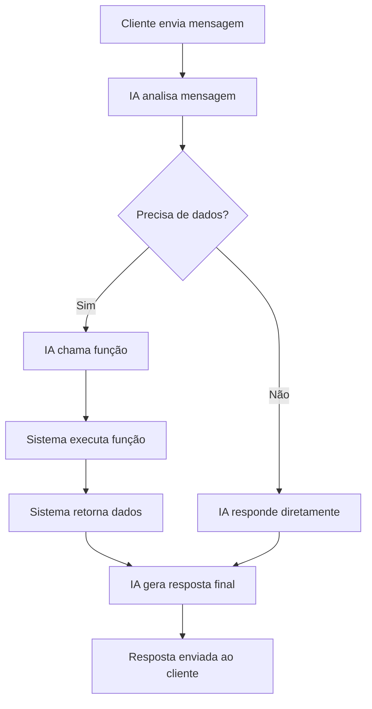

# 🧠 Function Calling - Sistema de Barbearia

Este documento explica como o **Function Calling** foi implementado no sistema de barbearia para permitir que a IA (Luna) acesse dados reais do sistema.

## 🎯 **O que é Function Calling?**

Function Calling permite que a IA chame funções específicas para:
- ✅ Verificar se um cliente está registrado
- ✅ Buscar serviços disponíveis
- ✅ Verificar profissionais disponíveis
- ✅ Verificar disponibilidade de horários
- ✅ Criar agendamentos

## 🚀 **Como Funciona**

### **1. Fluxo Básico**



### **2. Exemplo Prático**

**Cliente:** "Quais serviços vocês oferecem?"

**IA:** (chama `get_available_services`)
```json
{
  "name": "get_available_services",
  "arguments": {}
}
```

**Sistema:** (retorna dados)
```json
{
  "services": [
    {
      "id": 1,
      "name": "Corte Masculino",
      "price": 35.00,
      "duration": 30
    },
    {
      "id": 2,
      "name": "Barba",
      "price": 25.00,
      "duration": 20
    }
  ]
}
```

**IA:** "Oferecemos os seguintes serviços:
- Corte Masculino: R$ 35,00 (30 min)
- Barba: R$ 25,00 (20 min)
- Corte + Barba: R$ 50,00 (45 min)

Qual serviço você gostaria de agendar?"

## 🛠️ **Funções Disponíveis**

### **1. `check_customer_registration`**
Verifica se um cliente está registrado no sistema.

**Parâmetros:**
- `phone` (string): Número de telefone do cliente

**Exemplo:**
```json
{
  "name": "check_customer_registration",
  "arguments": {
    "phone": "5511999999999"
  }
}
```

### **2. `get_available_services`**
Retorna a lista de serviços disponíveis.

**Parâmetros:**
- `establishment_id` (string, opcional): ID do estabelecimento

**Exemplo:**
```json
{
  "name": "get_available_services",
  "arguments": {
    "establishment_id": "1"
  }
}
```

### **3. `get_available_professionals`**
Retorna a lista de profissionais disponíveis.

**Parâmetros:**
- `establishment_id` (string, opcional): ID do estabelecimento

### **4. `check_availability`**
Verifica disponibilidade de horários.

**Parâmetros:**
- `date` (string): Data desejada (YYYY-MM-DD)
- `service_id` (string): ID do serviço
- `professional_id` (string, opcional): ID do profissional

### **5. `create_appointment`**
Cria um novo agendamento.

**Parâmetros:**
- `customer_phone` (string): Telefone do cliente
- `service_id` (string): ID do serviço
- `date` (string): Data do agendamento
- `time` (string): Horário do agendamento

## 🧪 **Como Testar**

### **1. Via API**

```bash
# Testar com uma mensagem específica
curl -X POST http://localhost:3000/function-calling-test/test \
  -H "Content-Type: application/json" \
  -d '{
    "message": "Quais serviços vocês oferecem?"
  }'

# Executar cenários de teste predefinidos
curl -X GET http://localhost:3000/function-calling-test/run-scenarios
```

### **2. Cenários de Teste**

O sistema inclui cenários de teste automáticos:

1. **Registro de Cliente:** "Olá, meu nome é João e meu telefone é 5511999999999"
2. **Consulta de Serviços:** "Quais serviços vocês oferecem?"
3. **Agendamento:** "Quero agendar um corte masculino para amanhã às 14h"
4. **Verificação de Cadastro:** "Preciso verificar se estou cadastrado, meu telefone é 5511999999999"

### **3. Logs de Debug**

Os logs mostram o fluxo completo:

```
[TEST] Testando function calling com mensagem: "Quais serviços vocês oferecem?"
[TEST] Resposta inicial da IA: (IA decide chamar função)
[TEST] Executando 1 function call(s)
[TEST] Executando função: get_available_services {}
[TEST] Buscando serviços do estabelecimento: 1
[TEST] Resultado da função get_available_services: {success: true, data: {...}}
[TEST] Resposta final: "Oferecemos os seguintes serviços..."
```

## 🔧 **Implementação Técnica**

### **1. Estrutura das Funções**

```typescript
const barberShopFunctions: AIFunctionHandler[] = [
  {
    definition: {
      name: 'check_customer_registration',
      description: 'Verifica se um cliente está registrado...',
      parameters: {
        type: 'object',
        properties: {
          phone: {
            type: 'string',
            description: 'Número de telefone do cliente'
          }
        },
        required: ['phone'],
        additionalProperties: false
      }
    },
    handler: async (args: Record<string, any>): Promise<AIFunctionResult> => {
      // Lógica da função
      return { success: true, data: result };
    }
  }
];
```

### **2. Integração no Webhook**

```typescript
// No EventMessagesUpsertService
const aiResponse = await aiProvider.generateAIResponse(
  fullText,
  this.prompt,
  contextMessages,
  undefined, // sentiment
  barberShopFunctions, // Funções disponíveis
);

// Processar function calls
if (aiResponse.functionCalls && aiResponse.functionCalls.length > 0) {
  for (const functionCall of aiResponse.functionCalls) {
    const result = await executeFunction(functionCall);
    // Adicionar resultado ao contexto
  }
}
```

## 🎨 **Vantagens**

1. **✅ Dados Reais:** IA acessa dados atualizados do sistema
2. **✅ Automação:** Processo de agendamento automatizado
3. **✅ Precisão:** Informações sempre corretas
4. **✅ Experiência:** Conversa natural e fluida
5. **✅ Escalabilidade:** Fácil adicionar novas funções

## 🔮 **Próximos Passos**

1. **Integração Real:** Substituir mocks por chamadas reais à API
2. **Validação:** Adicionar validação de dados com Zod
3. **Cache:** Implementar cache para dados frequentemente acessados
4. **Monitoramento:** Adicionar métricas de uso das funções
5. **Testes:** Expandir testes unitários e de integração

## 📚 **Referências**

- [OpenAI Function Calling](https://platform.openai.com/docs/guides/function-calling)
- [DeepSeek Function Calling](https://api-docs.deepseek.com/guides/function_calling)
- [Documentação do Sistema](README.md)

---

**🎉 Agora a Luna pode acessar dados reais do sistema e criar agendamentos automaticamente!** 